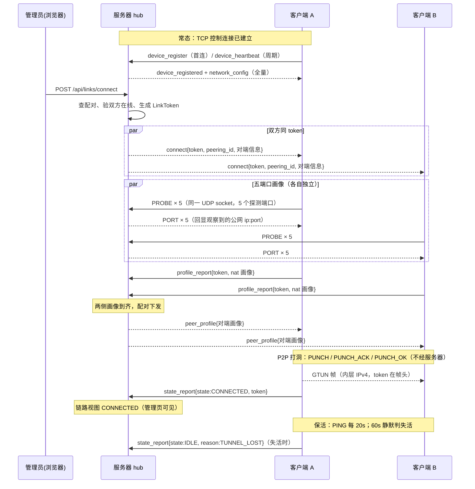

# 01 系统架构总览

> 本章是全文档集的主线结论，02–07 只展开各自层面的细节，不复述本章。

## 1. 项目定位

GTun-lite 是一个**轻量级 P2P 虚拟局域网**：多台设备经服务器协调完成 UDP NAT 穿透后点对点直连，共享一个虚拟网段（如 `10.206.0.0/24`）。

三条硬性定位约束：

- **隧道数据不经服务器**。服务器只是会合/控制点（rendezvous），建成后的隧道是两端之间的 UDP 直连——服务器重启、升级甚至宕机都不影响已建立的链路。
- **纯 Go、无 CGO**。服务端 SQLite 用纯 Go 驱动（modernc.org/sqlite），建表 SQL 与管理页均 `go:embed` 内嵌，单二进制部署。
- **单机小规模**。按 ≤8 台设备/网络设计，管理面无鉴权（默认只绑回环），是受信网络下的开发工具定位。

## 2. 三大平面

| 平面 | 传输 | 默认端口 | 职责 | 实现 |
|---|---|---|---|---|
| 控制面 | TCP + JSON Lines | `0.0.0.0:10000` | 设备注册、心跳、配置下发、建链意图下发、状态上报 | `internal/server/control.go` + `internal/client/control.go`，消息定义在 `internal/common/tcp_message.go` |
| 探测面 | UDP × 5 连续端口 | `0.0.0.0:10000–10004` | 无状态回显客户端观察到的公网地址，供 NAT 画像采样 | `internal/server/probe_reflector.go`，包格式在 `internal/common/probe.go` |
| 数据面 | UDP P2P 直连 | 内核随机分配 | GTUN 二进制帧承载内层 IPv4 包，两端直传，不经服务器 | `internal/tun/dataplane.go` + `internal/client/worker.go`，帧格式在 `internal/common/gtun.go` |

注意控制面 TCP 与探测面 UDP 的端口数字重叠（默认都是 10000 起）——协议不同，互不冲突；探测面 5 端口与控制面端口可以配置错开。

## 3. 模块地图

```
gtun-lite/
├── cmd/server            # 服务端入口：装配 store/hub/control/reflector/admin
├── cmd/client            # 客户端入口：fd 自举 → 身份 → manager → control
├── internal/common       # 公共协议层：无状态的类型+校验+编解码（详见 02 篇）
├── internal/tun/         # TUN 平台层的跨平台部分：接口、preflight、数据面
│   ├── mac/              #   macOS utun 实现（内核控制套接字）
│   ├── linux/            #   Linux /dev/net/tun 实现
│   └── win/              #   Windows wintun.dll 绑定
├── internal/client       # 客户端业务：manager/worker/control/身份/helper（04、05 篇）
├── internal/server       # 服务端业务：hub/control/link/store/admin/reflector（06、07 篇）
├── schema/               # SQLite 建表 SQL（go:embed 进二进制）
├── wintun/               # Windows TUN 驱动预编译 DLL 与头文件
└── test/e2e/             # 真机测试脚本（real-lan.sh / real-wan.sh）
```

依赖方向：`cmd/server` → `internal/server`，`cmd/client` → `internal/client`；`internal/client` 依赖 `internal/common` 与 `internal/tun`，`internal/server` 依赖 `internal/common` 与 `schema`（内嵌建表 SQL），两者彼此不依赖。

## 4. 端到端建链时序



拆除链路（`POST /api/links/disconnect`）与查询（`POST /api/devices/{id}/query`）的流程见 [06-服务端.md](06-服务端.md)。

## 5. 设计哲学

**简单、直接、可验证。**

- 删除所有「以防万一」的代码（碰撞重试、严格校验）
- 问题暴露优于静默降级
- 配置显式优于自动协商（三档可选，非法值拒绝启动，无运行期降级）
- 失败快速优于复杂恢复（任一侧报失败即失败，删除 RECOVERING）
- 状态有唯一归属（客户端管隧道事实，服务器管下发意图）
- 操作要么完整要么不做（单侧离线拒绝下发，不产生分裂状态）
- UUID 替代碰撞检查（删除极端场景防御）

错误处理原则（各模块统一遵守）：

| 场景 | 精简版行为 |
|---|---|
| 数据面队列满 | 丢新包 + 每秒至多一条节流日志（丢包由内层 TCP 重传吸收） |
| 控制面发送阻塞 | 不丢消息：阻塞排队，超过 write_timeout 视为会话卡死，关闭会话 |
| helper 创建失败 | 直接拒绝启动（配置错误早暴露） |
| 路由冲突 | 返回错误，停止 Apply（不跳过、不豁免） |
| 协议未知字段 | 允许（向前兼容是刻意的双端决策） |

日志策略：关键路径（TUN 创建/清理失败、路由冲突、控制断连、打洞超时、数据面异常）必须 ERROR/WARN 留痕；状态转换、配置推送、Worker 起停记 INFO；队列深度、逐包收发、内部重试不记录。

## 6. 权责划分：服务器管意图，客户端管事实

这是整个系统最核心的架构决策。

```
服务器（意图 intent）             客户端（事实 fact）
├── 该不该建这条链路               ├── 隧道现在通不通
├── 下发 CONNECT                  ├── 打洞成功 / 失败
├── 下发 DISCONNECT               ├── 保活存活 / 失活
└── 主动 QUERY 当前状态            └── 重连后如实上报
```

**服务器不推断隧道状态**。它只知道自己下发过什么意图、客户端上报过什么事实；两者不一致时，以客户端为准。服务器对客户端只有三个操作，语义正交：

| 操作 | 方向 | 语义 | 双方在线？ |
|---|---|---|---|
| CONNECT | 服务器 → 双方 | 建链意图（重试 = 再下发一次） | 要求 |
| DISCONNECT | 服务器 → 双方 | 拆链意图 | 要求 |
| QUERY | 服务器 → 单方 | 只读拉取该客户端全部链路状态 | 不要求 |

原版的 `retry`/`clear` 语义分别合并进 CONNECT/DISCONNECT；客户端主动推送状态变更的通道删除，改为「即时转场上报 + 重连全量上报 + QUERY 拉取」三条路径（见 [04-客户端.md](04-客户端.md)）。

### 6.1 三条链路不变量

实现落在 `internal/server/link.go`，是服务端状态机的地基：

1. **TCP 断开不触发任何链路状态转换**。控制面断连期间隧道很可能还在跑（P2P 保活自己判存活），服务器保持原状态不动。
2. **CONNECT/DISCONNECT 要求链路双方 TCP 均在线**，任一侧离线即拒绝（`PEER_OFFLINE`）且不改状态。只下发给一侧会产生「一侧在打洞、另一侧不知道」的分裂状态。
3. **任一侧报失败即判失败**（悲观判定），不等另一侧确认、不做多数表决；token 守卫防旧尝试的迟到失败打自杀。

### 6.2 客户端离线时的状态展示

管理页对离线设备的链路展示三段独立信息，不合并成一个字段：

```
已离线 · CONNECTED · 最后更新 2026-08-26 14:03:12（12 分钟前）
└─ 在线性      └─ 最后已知状态   └─ 该状态的时间戳
```

| 字段 | 来源 | 语义 |
|---|---|---|
| 在线性 | 服务器当前 TCP session 表 | 实时且可信 |
| 最后已知状态 | 内存链路状态 `Link.State` | 客户端最后一次上报的事实 |
| 时间戳 | 内存链路状态 `Link.UpdatedAt` | 判断新鲜度 |

不显示「未知」：隧道不经过服务器，离线期间「客户端最后一次亲口说的 CONNECTED」比「未知」更接近现实，其余语义见表。

### 6.3 服务器重启的精确语义

- **完全无影响**：已建成的隧道（P2P 直连）、配置数据（4 张表）、虚拟 IP 分配（`network_members.virtual_ip` 持久化 + UNIQUE）、设备身份（客户端自持文件）。服务器的链路状态记录本身就是缓存，丢了无所谓——客户端重连全量上报后重建。
- **有影响，但设计已覆盖**：客户端短暂断连（固定 5s 重连）；期间隧道继续通、管理页显示「已离线 · 最后已知状态 · 时间戳」、无法下发 CONNECT/DISCONNECT（双方不在线 → `PEER_OFFLINE`）。
- **有信息损失，明确接受**：重启若恰好跨越某条链路的打洞窗口，该次失败的 reason 随 TCP 断开丢失，重连后只上报当前状态（IDLE）。不做补偿——打洞失败的处置就是再下发一次 CONNECT，查因看客户端日志。

## 7. 权责划分换来了什么

| # | 得到的 | 代价 |
|---|---|---|
| 1 | 控制面故障与数据面完全解耦：服务器可随时重启，不再是隧道可用性的依赖，单点故障范围从「整个系统」缩到「管理操作」 | — |
| 2 | 状态只有一个事实来源：重连逻辑退化为一次覆盖写（`AdoptClientReport`），不需要比对/仲裁/版本向量 | 服务器状态可能滞后于真实，直到重连上报或 QUERY |
| 3 | 分裂状态在结构上不可能出现（双方在线才下发），不需要脏状态清理与孤儿回收 | 一侧掉线时管理操作被拒绝（诚实的拒绝，优于留烂摊子） |
| 4 | 失败判定不需要等待：检测延迟 = 较快一侧发现的时间；不需要「等不到另一侧确认」的超时兜底 | — |
| 5 | API 面收窄到三个正交操作；测试矩阵从 N×M 缩小到 3×3 | — |
| 6 | 可观测性反而变强：QUERY 拿到的是客户端实测而非服务器推断 | QUERY 有网络往返开销（可做短 TTL 缓存，但不要缓存成「服务器自己维护的状态」） |
| 7 | — | 依赖客户端诚实上报：受信网络前提下可接受，面对不受信客户端需重新评估 |

## 8. 原版 → 精简版对照（删除机制清单）

原版指已废弃的前代 GTun 实现，不在本仓库；对比只作为砍除决策的论证记录保留，防止机制被回头加回去。一张表同时回答「原来怎么做、现在怎么做、为什么不需要原来的」：

| 维度 | 原版做法 | 精简版 | 为什么不需要原机制 |
|---|---|---|---|
| 链路状态 | 6 态（含 RECOVERING / PENDING） | 3 态（IDLE / CONNECTING / CONNECTED） | TCP 断开不触发转换，直接问客户端 |
| 状态归属 | claim 保持与接管、attempt 失效水位 | 客户端是唯一事实源，token 唯一标识尝试 | 服务器不拥有隧道，重连上报即采信 |
| 分裂状态 | 单侧下发 + 脏状态清理 + 孤儿回收 | 双方在线才下发，结构上不产生分裂 | 不产生就不需要清理 |
| 失败判定 | 双方结果共同确认 | 任一侧报失败即失败 | 隧道是双向的，一侧不通即不通 |
| 服务器操作 | retry / clear / 多端点 | CONNECT / DISCONNECT / QUERY | retry 就是再发 CONNECT，clear 就是 DISCONNECT |
| 端口预测 | 5 级（Profile/Bank/Range/Sweep/Birthday） | 直连 + helper 信标/反向握手为主，Range 向上扫描备援 | 随机分配端口下扫描不中（真机实证，见 [05-NAT穿透与打洞.md](05-NAT穿透与打洞.md)） |
| helper 档位 | RLIMIT 探测选档 + 运行期降级 | 配置显式三档，启动校验不够即拒启 | 静默降档让打洞成功率不可复现 |
| ID 生成 | 碰撞检测 + 最多 11 次查库重试 | UUID v4 一次生成 | 碰撞概率不在工程考虑范围 |
| SQLite 表 | 5 张（含事件表） | 4 张（链路状态本就不落库） | 事件表只写不读，结构化日志替代 |
| 配置代次 | networks.revision | 无（推送始终全量） | 单 owner 串行投递已消灭乱序（见 [07-存储与管理面.md](07-存储与管理面.md)） |
| JSON 校验 | DisallowUnknownFields | 标准解码，宽容未知字段，nil slice 统一为 `[]` | 双端同仓同发，结构校验已足够 |
| 队列 | 全局 10MB 字节级预算 | 固定长度 channel（控制面阻塞 / 数据面丢弃） | 8 设备内存压力极小 |
| HTTP 框架 | gin | 标准库 net/http（Go 1.22+ ServeMux） | 纯 JSON 场景，删 15+ 间接依赖 |

> 教训（2026-08-27 真机验收，两轮共六处）：砍除行为时必须与原版逐点对照——「建成后丢弃对端 PUNCH」「OK 重发次数」「OK 补发路径」「helper 建成即停发」等偏差在局域网测不出，公网才暴露。删除机制可以，静默改变保留机制的语义不行。

精简版保留 100% 的 TUN 平台层踩坑经验（fd 非阻塞进 poller、地址清理时序、路由冲突无豁免——详见 [03-TUN设备层.md](03-TUN设备层.md)），核心思想总结为八条：保留血泪、删除防御、简化协商、快速失败、直接设计、删除极端、状态单一归属、操作原子。
