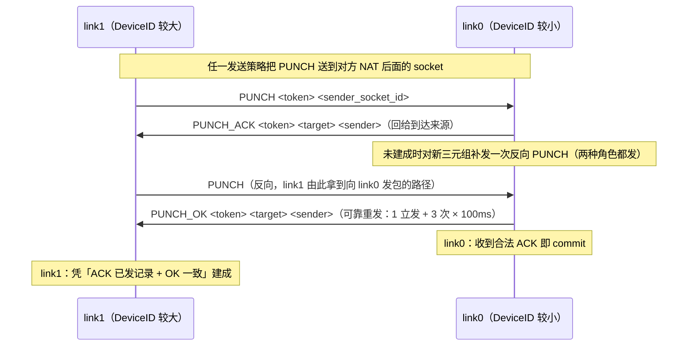

# 05 NAT 穿透与打洞（internal/client/worker.go 专题）

## 1. 定位与总流程

`linkWorker` 承载**一次**链路尝试的全部阶段（一个 CONNECT token 对应一个 Worker，失败即终态，重试由服务器下发新 CONNECT 驱动）。总流程：

```
阶段0  准备     serverIPv4 解析服务器（失败归 PROBE_TIMEOUT）
                selectLocalIPv4 选本机源地址（UDP connect 让内核选「通往服务器」的出口）
                主 socket 绑定该地址
阶段1  画像     同一 socket 向服务器 5 个探测端口各发 PROBE，收 PORT 回显
                → 分类 stable / variable / PROBE_IP_CHANGED
                → WorkerProfile 事件上报服务器（服务器配对后互发 peer_profile）
阶段2  等对端   等待服务器下发的对端画像
                预算 = probe.timeout + max(两端 punch 超时)；超时 → PUNCH_TIMEOUT
阶段3  打洞     按两侧画像组合选策略（第 3 节），预算 = stable 2s / variable 15s
                期间完成三步握手（第 4 节）
阶段4  保活     CONNECTED 后 PING 每 20s，60s 静默判失活 → TUNNEL_LOST
```

并发模型：`run` 是**唯一状态裁决者**（owner）；每个 socket 一个接收 goroutine，只投递 `wireEvent` 进 `eventsIn`（容量 64）；p2p 路径字段（选定 socket/对端地址）由 `dataMu` 保护。

## 2. 五端口画像

**算法**（`probe` + `classifyProfile`）：

1. 对服务器 `probe_base_port .. +4` 共 5 个 UDP 端口，用**同一个** socket 各发 `PROBE <nonce> <probe_id>`；
2. 每个端口独立做「发送-等待-匹配」循环（`probeOne`）：每端口最多 1+`retries` 次尝试（初始 1 次 + 重试 3 次，共 4 次等待），单次等待 `per_port_timeout`（1s），总预算 `probe.timeout`（30s）收敛；
3. 收集 5 个 `PORT` 回显（nonce 双重校验：发出的 nonce 与回显一致才接受），分类：

| 判定 | 条件 | 结论 |
|---|---|---|
| `PROBE_IP_CHANGED` | 5 次回显的公网 IP 不一致 | 家宽按流轮换出口，直接拒绝 |
| `stable` | 公网 IP 一致且 5 个映射端口全等 | NAT 端口可预测（endpoint-independent） |
| `variable` | 公网 IP 一致但端口不全等 | NAT 端口随机分配 |

单端口探测被滤（如防火墙黑洞）意味着画像不完整 → 如实 PROBE_TIMEOUT（设计行为：单端口缺失 = 诚实失败，真机验证见 [真机验收记录.md](../test/e2e/真机验收记录.md)）。

画像经 `profile_report` 上报；服务器收齐两侧后互发 `peer_profile`，双方进入打洞阶段。token 不匹配的迟到画像被丢弃（画像属于特定尝试）。

## 3. 打洞策略矩阵

| 本侧 \ 对侧 | stable | variable |
|---|---|---|
| stable | `directPunch`：100ms 间隔直连对端稳定端点（2s 预算；成功仅需 2~3 个 RTT；输竞态早离场交服务器重掷） | `rangeScan`：三级候选扫描（15s 预算） |
| variable | `pollHelpers`：helper 信标轮询（15s 预算） | `NAT_UNSUPPORTED` 预判拒绝，不进入打洞 |

发送侧之外，两侧同时启动**接收循环**：主 socket + variable 侧的全部 helper，每个 socket 一个 goroutine。

### 3.1 helper 信标（variable 侧，`pollHelpers`）

variable 侧把 helper 池按**全局 3ms 周期**轮询（逐发取当前池切片），每个周期内向对端 stable 端点发 PUNCH。语义要点：

- 每个_helper 发包的间隔 ≈ 档位 × 3ms_（256 档约 0.77s 一轮，1024 档约 3s 一轮）；
- **建成后收缩、不停发**——commit 时把池收缩到选中的那一个 helper（`pruneHelpers`，其余关闭），选中的继续播到打洞预算耗尽。原因：对端（stable 侧）可能尚未建成，它的握手材料就是信标；本侧先建成就把选中的也停掉，会让对端在预算内零握手来源（2026-08-27 公网真机教训，见 4.3 节）。选中的一条足以维持握手来源：对端回 ACK/反向 PUNCH 只会打到它收过信标的端口，`sendSelectedPathOK` 的触发也只依赖选定路径的信标；
- 大量 PUNCH 从不同源端口到达对端，其中任意一个在双方 NAT 上打通映射即可完成握手。

### 3.2 三级候选扫描（stable 侧对 variable，`rangeScan`）

stable 侧知道对端最后观测端口（对端画像里最后一个映射端口），但 variable NAT 给后续 socket 分配的端口不可预测。策略：

1. 先等 `helper 初始化窗口`（2s）——给对端创建 helper、开始播信标留时间；
2. 按**三级候选流**（`scanplan.go`，纯逻辑可穷举测试）逐个发包，上一级发完立即进下一级，建成/取消/预算耗尽（15s）即止：
   - **一级 邻域**：最后观测端口 ±10 中心外扩（21 个候选，约 63ms）。假设映射落在画像端口近旁（时序交错、小偏移顺序分配）；
   - **二级 均匀扫描**：步长 `helper_count/4`（256/512/1024 档对应 64/128/256）从 1024 覆盖全端口空间（256 档 1008 个候选，约 3s）。假设随机起点但映射连续——鸽笼原理保证任意 helper_count 宽的连续段内至少落进 4 个候选；
   - **三级 随机**：无重复随机填满剩余预算（惰性洗牌，跳过前两级已发端口）。无结构假设兜底：对端 helper 池就是 helper_count 个活靶子，预算内数千发即近必中。

> 三级各押一条对 NAT 分配规律的假设，互为补充：顺序型由一级命中、随机起点连续段由二级确定性覆盖、离散随机由三级收敛。旧版「helper_count+48 向上窗口」只押第一条假设，且把预算的大头花在对同 304 个候选的循环重发上；三级流把全部预算换成新候选。

**实测结论（2026-08-29 netns 实验室，见 [真机验收记录.md](../test/e2e/真机验收记录.md)）**：三级候选流在「信标全灭、仅剩扫描」的最难环境（stable 侧端口受限 NAT、EIM 映射、丢包不留痕）下 sweep 段命中、一次建成，4 轮全 sweep（发包 32~531 / 预算 3055）。适用域：stable 侧为无 NAT / EIM 型 / 严格但不留痕 NAT 时成立；**双侧均为 conntrack 系 NAT（按流分配 + 丢包留负记录）时不可用**——beacon 开洞的端口与扫描可保留的端口互斥，属协议形态问题而非代码缺陷（对策候选见 [08](08-构建配置与部署.md) §7.1 候选 11）。

> **开发期观察设施（删除须经用户明示，勿自行删除）**：`scanlog.go` 把每发候选、入站信标的唯一源端口、命中溯源（哪一级、第几次猜中）写到工作目录 `gtun-scan.log`（写死路径、不走配置、失败静默丢弃），用于观察对端 NAT 端口分配规律。删除时连同 worker.go 中的调用点整体移除。

### 3.3 helper 档位

256/512/1024 三档（YAML 显式配置，默认 256），决定 variable 侧端口覆盖率。启动即校验 fd 装得下「档位 + 1024 冗余」，不够拒绝启动；**无运行期降级、无探测选档**（原版的 RLIMIT 探测选档 + 运行期降级已删：静默降档会让打洞成功率悄悄变化，故障排查无法复现）。创建是全有或全无（`CreateHelpers`）。

## 4. 三步握手

### 4.1 角色裁决

`isLink0 = 本机 DeviceID < 对端 DeviceID`（字典序）——这是握手不对称性的唯一锚，两端独立计算、结论互补。link0 是握手的「确认方」，link1 是「快速路径方」。

### 4.2 消息流转



- **ACK 的合法性**（link0 侧）：`TargetSocketID == 实际到达的 socket`，且本侧该 socket 曾向此来源发过 PUNCH（防第三方伪造）。
- **link0 建成条件**：收到合法 ACK → `commit`（选定 p2pSocket / peerLive）→ PUNCH_OK 可靠重发。重发不能以「本侧 connected」作退出条件——OK 的目的是让对方建成，本侧状态与对方是否收到无关。
- **link1 建成条件**：曾向某来源回过 ACK，且从该来源收到字段一致的 OK。
- **迟到的 PUNCH**：已建成的 link0 收到 PUNCH 不回 ACK，改为补发一次 PUNCH_OK，且**必须从本侧选定的路径发出**。

### 4.3 三条真机血泪（对称 NAT 场景，2026-08-27）

这些行为在局域网（时序紧凑）测不出来，公网才暴露，均已修复并有单测钉住：

1. **OK 必须可靠重发**（1 + 3×100ms）：单发 OK 丢包则 link1 永远等不到，单侧建成。
2. **helper 信标建成后不停发**：link1 的握手材料就是信标；停发即对端零来源。（2026-08-29 起配合 `pruneHelpers`：建成后收缩到选中的 helper，选中的不停发——语义不变，约束对象从「全部」改为「选定路径」。）
3. **OK 补发必须走选定路径**（最隐蔽）：曾从「收到 PUNCH 的 socket」发出，导致 link1 在 helper Y 上建成、link0 在 helper X 上互通——对称 NAT 下两条映射互不相通，隧道**双向黑洞**，60s 保活齐超时。补发固定走本侧 commit 选定的路径后收敛。

## 5. 接收循环

每个 socket 一个接收 goroutine（`startReceiverLocked`）：

- 缓冲大小 = `max(GTUNHeaderBytes + tun.mtu, MaxP2PControlDatagram + 1)`——按配置推导而非固定 64KB（1024 helper 档位下固定 64KB 要吃 64MB 纯缓冲）；
- 1s 周期 `SetReadDeadline`：让 ctx 取消能被阻塞的 ReadToUDP 感知；
- 分流：前 4 字节 == `"GTUN"` → 数据帧走 `deliverFrame` 四级验证（见 [04-客户端.md](04-客户端.md) 7.2 节）；否则按 P2P 控制包解析，**来源 IP 必须等于对端画像的公网 IP**（第三方伪造控制包直接丢弃）；
- 解析后的控制事件投递给 owner（`run`）裁决，接收 goroutine 自己不做状态变更。

## 6. 保活与失活

CONNECTED 后启动保活：

| 参数 | 值 | 说明 |
|---|---|---|
| PING 间隔 | 20s | `PING <token> <sequence>`，sequence 单调递增 |
| 失活阈值 | 60s | 滑动窗口：任何合法入站流量（数据帧或控制包）都 `touchActivity()` 刷新 |

失活 timer 是**滑动的**：静默时长不足阈值时按剩余预算重新武装，不是固定起点倒计时。超阈值 → `WorkerLost(TUNNEL_LOST)` 上报，链路回 IDLE。任一侧判失活上报即失败（服务器侧悲观判定，见 [06-服务端.md](06-服务端.md)）。

单向黑洞（一侧收不到任何隧道流量）场景：仅静默侧在 60s 超时并上报失活——对端因持续收到静默侧的**出站** PING 而保持存活（黑洞只挡静默侧的入站方向）。链路靠这一份单侧上报收敛，正是「任一侧报失败即失败」的用武之地。真机验证见 [真机验收记录.md](../test/e2e/真机验收记录.md) D4。

## 7. 固定协议参数总表

这些参数**不进配置**（调它们需要的是抓包分析而非改配置的运维能力）：

| 参数 | 值 | 用途 |
|---|---|---|
| PUNCH 直连间隔 | 100ms | stable-stable directPunch |
| helper 轮询周期 | 3ms（全局） | variable 侧 pollHelpers |
| PUNCH_OK 重发 | 100ms × 3 次（加 1 次立发） | 可靠送达 link1 |
| helper 初始化窗口 | 2s | rangeScan 起扫前等待 |
| 保活 PING | 20s | CONNECTED 后 |
| 失活阈值 | 60s | 滑动窗口 |
| 三级扫描 | 邻域 ±10 / 步长 helper_count/4 / 随机填满 | 依次消耗预算的候选流（scanplan.go） |
| 端口空间 | [1024, 65535] | 回绕边界 |

## 8. 失败与重试模型

一次尝试失败即终态（`finish` CAS 幂等：cancel → 关主 socket → 关全部 helper → wg.Wait）。**客户端不做自动重连链路**：

- 重试 = 服务器再下发一次 CONNECT（新 token、新 Worker）；
- DISCONNECT / 配置变化也会停 Worker；
- 打洞失败原因（Reason）随失败上报给服务器记录展示；服务器重启跨越打洞窗口时该原因丢失，接受不补偿（见 [01-系统架构总览.md](01-系统架构总览.md) 6.3 节）。
