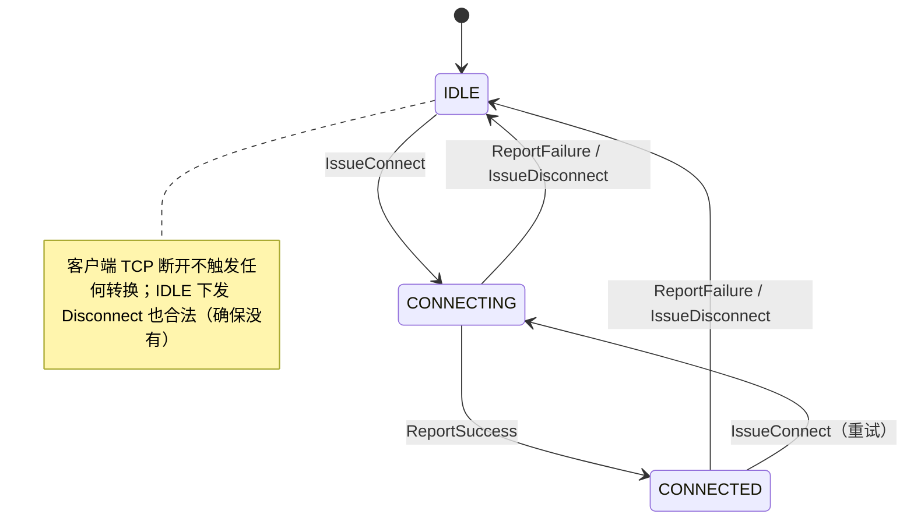

# 06 服务端（internal/server）

## 1. 模块定位

服务端是**会合/控制服务器**：只下发意图（CONNECT/DISCONNECT/QUERY）并登记客户端上报的事实，隧道数据不经服务器（权责划分见 [01-系统架构总览.md](01-系统架构总览.md) 第 6 节）。

三个监听面：

| 面 | 默认地址 | 实现 |
|---|---|---|
| 控制面 | TCP `0.0.0.0:10000` | `control.go` |
| 探测面 | UDP `0.0.0.0:10000–10004` | `probe_reflector.go` |
| 管理面 | HTTP `127.0.0.1:9090` | `admin_api.go` + `web.go`（详见 [07-存储与管理面.md](07-存储与管理面.md)） |

## 2. 文件清单

| 文件 | 职责 |
|---|---|
| `doc.go` | 包文档：权责划分与三条不变量 |
| `config.go` | `ServerConfig`、严格 YAML 加载、交叉校验 |
| `hub.go` | 会话表 + 链路表 + 画像收集表的唯一 owner（单 goroutine 串行状态机） |
| `control.go` | TCP 控制面：监听、逐连接生命周期、上行分发、下行写泵 |
| `link.go` | 链路内存状态机（IDLE/CONNECTING/CONNECTED + Token 配对） |
| `store.go` | SQLite 持久化（仅配置数据，见 07 篇） |
| `admin_api.go` | 管理 REST API（见 07 篇） |
| `web.go` + `index.html` | go:embed 单文件管理控制台（见 07 篇） |
| `probe_reflector.go` | 5 端口 UDP 无状态回显反射器 |

## 3. 启动流程与 fail-fast（cmd/server/main.go）

`main` 只调 `os.Exit(run())`（defer 语义与退出码设计见 [08-构建配置与部署.md](08-构建配置与部署.md) 第 1 节）。`run` 按序：

1. `-config` flag（默认 `server.yaml`）→ `LoadServerConfig`；
2. slog TextHandler → stderr；
3. `OpenStore`（SQLite；空库按内嵌 schema 建表，结构不符拒启动），defer Close；
4. `NewHub(store, config, log)`（owner goroutine 启动），defer Close；
5. `NewControlServer(...).Listen()` —— **同步绑定**控制面 TCP；
6. `signal.NotifyContext(SIGINT, SIGTERM)`；
7. `NewProbeReflector(bind, basePort)` —— 5 个 UDP 端口，**绑定失败即退出进程**（「半套探测端点比没有更糟」：残缺探测面会让画像永远不完整且难定位）；
8. `net.Listen("tcp", admin.bind)` —— 同步绑定管理面，占用即退出；
9. goroutine 并发跑 `control.Serve(ctx)` 与 `adminServer.Serve`，任一运行期错误进 `serveErr`；
10. select 等待信号 / 反射器错误 / serve 错误；退出时 `adminServer.Shutdown` → 等 serveDone → 返回退出码。

**优雅关闭链**（defer 逆序）：reflector.Close（等全部读循环退出）→ hub.Close（主动 `sess.end()` 断开全部会话；**链路内存状态就此丢弃是设计行为**，客户端重连全量上报即重建）→ store.Close。

## 4. hub：单 owner 串行状态机

### 4.1 数据结构

- `session`：`device DeviceID` + `conn net.Conn` + `send chan outbound`（缓冲 64）+ `dead chan struct{}` + `endOnce`。`end()` 幂等（close dead + 关连接）。
- `outbound`：消息 + `closeAfter` 标志（duplicate_login / error 写完即关）。
- `hubState` 四张表：
  - `sessions map[DeviceID]*session` —— 键存在即在线（设备 → 当前连接唯一映射）；
  - `links map[common.Link]*Link` —— 键为字典序规范化的设备对，条目按需创建、不随会话增删；
  - `pending map[common.Link]*pendingProfiles` —— 每链路本次尝试的两侧 NAT 画像收集；
  - `pendingDevices map[DeviceID]deviceRegistration` —— 注册审批制的内存待审批表（随会话生灭，同意注册后落库，见 [07-存储与管理面.md](07-存储与管理面.md) 第 4.5 节）。
- `Hub`：`commands chan func(*hubState)` + stop/done。

### 4.2 并发模型：为什么是单 owner

`hubState` 全部字段无锁，只被 `run()` 里的 owner goroutine 触碰；所有状态变更经由 `commands` 通道排队为**串行命令**。串行化一次解决三个问题：

1. 并发安全（不需要锁）；
2. 配置推送顺序（组装与投递在同一命令内完成，不会「新库旧配置后到」）；
3. 在线判定原子性（「查在线 + 投递」是同一命令内的连续步骤，无窗口）。

配套语义：

- `submit`：**排队阶段响应 ctx 取消与停机；执行阶段不响应**——半途丢弃会留下「CONNECT 只发到一侧」的副作用；
- `session.deliver`：向 `send` chan 排队，满则阻塞，兜底三选一：入队成功 / `<-sess.dead`（返回 ErrSessionNotCurrent）/ `time.After(write_timeout)` 卡死超时——控制面**不丢消息**，卡死视作会话故障关闭；
- SQLite 写入只发生在 owner goroutine；与管理 API handler 的写并发靠 SQLite 写锁 + DSN busy_timeout 兜底。

### 4.3 关键入口

| 方法 | 语义 |
|---|---|
| `Register` | 容量检查（`server_full`）→ 审批分流（库里有 → upsert 刷新；新设备 → 只记 pendingDevices 不落库）→ 顶替旧会话（发 duplicate_login）→ `device_registered` + 首份 `network_config`（顺序即线上顺序） |
| `SessionEnded` | 读/写循环退出通报；仅当仍是当前会话才摘除；**链路状态不动（不变量 1 的实现位置）** |
| `Heartbeat` | 只校验会话仍是当前会话 |
| `HandleStateReport` | Full=true 快照 → `AdoptClientReport` 直接覆盖；转场 → token 守卫的 `ReportSuccess`/`ReportFailure` |
| `HandleProfileReport` | 画像收集，两侧到齐 → 互发 `peer_profile`（`adoptProfile`），随后清 pending |
| `IssueConnect` | 查配对（404 若无）→ 双方在线检查与投递**同一条命令**（无窗口）→ 生成 token → 清 pending → 向双方投递同 token 的 `connect`（各含对端信息） |
| `IssueDisconnect` | 同上；内存 token 为空时生成占位 token 保持消息合法 |
| `IssueQuery` | 向单台在线设备发 `query`；离线返回 ErrDeviceOffline |
| `PushConfig` / `PruneLinks` | 配置变更后重推 / 删除配对后清内存孤儿条目 |
| `ApproveDevice` / `Kick` | 待审批设备落库为正式设备（不在待审批表 → ErrNotFound）/ 终结设备的当前会话（删除在线设备时用，离线则空操作） |
| `Snapshot` | 在 owner 内一次性组装 DeviceView[] + LinkView[]——在线性与链路状态取自同一瞬间；读路径不建条目 |

上报的换算链（`adoptReport`）：`peering_id` → `store.PeeringByID` 查出 DeviceA/DeviceB → `common.NewLink` 规范化为字典序键 → `state.linkFor(link)` 取/建条目。两道防线：上报者必须是链路一端；token 守卫（`link.matches`）。

哨兵错误：`ErrSessionNotCurrent`、`ErrDeviceOffline`、`ErrServerClosed`、`ErrConnectionLimit`（单独成哨兵以翻译为 `server_full` 而非 `internal_error`）。

## 5. 控制面会话（control.go）

### 5.1 连接生命周期（handleConnection）

1. **注册阶段**：读 deadline = now + `register_timeout`（10s）；第一条消息必须是 `device_register`，否则发 error 消息断开（`register_timeout` / `unknown_type` / `invalid_message`）。未注册连接不占会话表。
2. **无认证**：协议没有鉴权 token——设备身份就是客户端自持的 UUID device_id。注册审批制：库里已有的设备注册即 upsert 刷新，新设备不落库（见 hub 注册分流与管理页「同意注册」）。安全边界是网络层（管理面回环 + 控制面部署约定）。
3. 创建 `session`，启动写泵 `runWriter`，调 `hub.Register`；容量满映射为 `server_full`，其余失败 `internal_error`。
4. **消息循环**：每条读前置 deadline = now + `heartbeat_timeout`（60s）——**心跳超时用读超时实现**：任何入站消息（心跳或状态上报）都算活着。这比「timer + 代次」简单且无竞态。
5. `dispatch` 上行白名单：`device_heartbeat` / `state_report` / `profile_report` / `device_unregister`；下行消息类型出现在上行方向 → `unknown_type` 终止（方向表封闭）。

### 5.2 下行写泵（runWriter）

每会话**唯一网络写者**保证下行顺序：从 `send` chan 取 → JSON marshal + LF → `SetWriteDeadline(write_timeout)` → 写出；`closeAfter` 消息写完即 `end()`。JSON Lines 分帧规则见 [02-公共协议层.md](02-公共协议层.md) 第 5 节。

### 5.3 会话顶替

同一 device_id 的新连接注册时：旧会话收到 `duplicate_login`（closeAfter=true）并被 `end()`；新连接接管 sessions 表。被顶替的客户端把 duplicate_login 视为进程级终态（身份被复制到别处运行，交运维处置）。

## 6. 链路状态机（link.go）

### 6.1 状态与字段

`Link` 字段：`State`、`Token`（与 State 严格配对：**IDLE ⇔ 空 token**）、`UpdatedAt`（每次变更必刷）、`LastReason`（最近一次已结束尝试的失败原因，宽松语义：失败上报时写入、新 CONNECT 下发时清空，其余路径不刷新）。

`set` 是唯一写入口（保证 UpdatedAt 不漏刷、IDLE 清 token）；`Invariants()` 供测试断言。

### 6.2 状态转换表

| 当前状态 | 事件 | 新状态 | 动作 |
|---|---|---|---|
| IDLE | 下发 CONNECT（双方在线） | CONNECTING | 生成 token，下发双方 |
| IDLE | 下发 CONNECT（任一侧离线） | IDLE | **拒绝下发**，返回 PEER_OFFLINE |
| CONNECTING | 任一侧上报成功 | CONNECTED | 记录 |
| CONNECTING | 任一侧上报失败 | IDLE | 清 token |
| CONNECTED | 任一侧上报失活 | IDLE | 清 token |
| CONNECTED | 下发 DISCONNECT（双方在线） | IDLE | 下发双方，清 token |
| CONNECTED | 下发 DISCONNECT（任一侧离线） | CONNECTED | **拒绝下发**，返回 PEER_OFFLINE |
| 任意 | 客户端 TCP 断开 | 不变 | **无动作**（隧道自己跑） |
| 任意 | 客户端重连并上报 | 采信上报值 | AdoptClientReport 覆盖 |

方法语义要点：

- `IssueConnect` 在**任何状态**调用都合法（重试 = 重发 + 换新 token）；
- `IssueDisconnect` 语义是「确保没有」而非「关掉开着的」——IDLE 链路也可下发（用于清理客户端侧的孤儿 Worker）；
- `ReportSuccess` 仅 CONNECTING 可前进（迟到成功不污染新尝试）；
- `ReportFailure` 悲观收敛（token 守卫：旧尝试的迟到失败不影响新 token）；
- `AdoptClientReport` 快照直接覆盖、不校验 token，唯一拒绝理由是自相矛盾（如 IDLE 带 token）。

### 6.3 刻意不落库

链路状态是 hub owner 的纯内存状态，从不进 SQLite。服务器重启必然全部丢失——这是设计接受的行为（重建 = 客户端重连全量上报，论证见 [01-系统架构总览.md](01-系统架构总览.md) 6.3 节与 [07-存储与管理面.md](07-存储与管理面.md)）。

## 7. 探测反射器（probe_reflector.go）

**作用**：NAT 画像采样（不是延迟测量）。客户端同一 UDP socket 向 5 个端口发 PROBE，反射器把「观察到的来源公网地址:端口」原样回显为 PORT。聚合分类全在客户端做。

设计要点：

- **无状态**：不聚合、不记录谁在探测；
- **fail-fast**：任一端口绑定失败或回写失败 → 整体失败 → 进程退出（`ListenAndServe` 内互斥处理 Close 抢在绑定完成前的竞态：`stopped` 标志防 Close 后绑上的端口泄漏）；
- **畸形报文限流记日志**：格式错误的 PROBE 静默丢弃，但每源 IP 每分钟至多一条 Warn（限流表上限 4096 条防自身内存无界增长）——UDP 端口会被扫描器打，逐包 Warn 是磁盘放大向量；
- base_port=0 时内核分配端口（仅测试用）。

## 8. 简化论证（相对原版）

完整对照表见 [01-系统架构总览.md](01-系统架构总览.md) 第 8 节。服务端侧的两个落地细节：

- **gin → 标准库 net/http**：`gin.H` → 结构体响应、`c.Param` → `r.PathValue`（Go 1.22+ ServeMux 模式路由）。
- **队列**：控制面 `session.send` 满则阻塞 + 卡死超时关会话；数据面队列在客户端（满则丢新包）。
