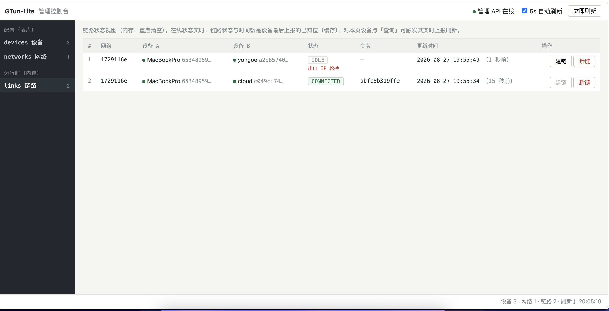

# 07 存储与管理面（schema / store / admin_api / web）

## 1. 定位

持久层只存**配置数据**（设备/网络/成员/配对），管理面（HTTP API + 内嵌 Web 控制台）是配置的写入口与运行时状态的只读视图。链路状态与事件刻意不落库（2.3 节）。

## 2. SQLite Schema（schema/server.sql）

建表 SQL 经 `schema/schema.go` 的 `//go:embed server.sql` 编进二进制——校验与建表同一份文件，部署包不再附 server.sql。整个建表在单事务内，`PRAGMA foreign_keys = ON`。启动时 `validateSchema` 要求表集合与内嵌 schema **完全一致**（恰好 4 张，多一张少一张都拒绝启动），另跑 `PRAGMA integrity_check` + `foreign_key_check`。

### 2.1 表结构

**devices** —— 设备登记表（行由客户端注册 upsert 自动创建/刷新）：

```sql
device_id TEXT PRIMARY KEY   -- CHECK GLOB 钉死 36 字符规范 UUID（连字符位都钉死）
name     TEXT NOT NULL
platform TEXT NOT NULL       -- CHECK IN (linux, darwin, windows)
created_at TEXT NOT NULL
```

**networks** —— 虚拟网络：

```sql
network_id TEXT PRIMARY KEY  -- 8 位小写 hex
name     TEXT NOT NULL
cidr    TEXT NOT NULL UNIQUE -- 完全相同网段才拒（重叠不查，见 08 第 8 节已知边界）
created_at TEXT NOT NULL
-- 无 revision 列（配置代次已删，见 2.3 节）
```

**network_members** —— 成员关系：

```sql
PRIMARY KEY (network_id, device_id)
device_id  TEXT NOT NULL     -- 全局 UNIQUE：一台设备同时只属一个网络
virtual_ip TEXT NOT NULL     -- UNIQUE(network_id, virtual_ip)
joined_at  TEXT NOT NULL
-- 两个 FK 均 ON DELETE CASCADE
```

**network_peerings** —— 配对关系：

```sql
PRIMARY KEY (network_id, device_a, device_b)
CHECK (device_a < device_b)          -- 与 common.Link 字典序规范化对应，同一对设备只一行
peering_id TEXT NOT NULL UNIQUE      -- 32 位小写 hex
created_at TEXT NOT NULL
-- FK 指向 network_members（ON DELETE CASCADE）
-- 不存任何「某次尝试」的列
```

### 2.2 刻意不存的东西

| 不存 | 理由 |
|---|---|
| 链路状态 | 纯内存（hub owner），重启即丢；客户端重连全量上报即重建，无需恢复流程 |
| 事件表（原 device_state_events） | 原版生产代码只写不读（读取方仅两个管理端点），是纯运维视图；结构化日志提供同样信息且不占热路径（每次状态变更的写事务、保留期裁剪、schema 演进）。若将来要页面化事件时间线，正确做法是接日志检索，不是把表加回来 |
| 配置代次（networks.revision） | 见下 |

**删除 revision 的三条理由**：

1. **会话内乱序已被单 owner 串行投递消灭**——TCP 有序 + 服务器侧配置组装与投递在同一 owner 命令串行执行，逻辑乱序窗口不存在；
2. **跨会话本来就旁路 revision**——重连推全量是常态路径，revision 从不参与跨会话判断；
3. **全量推送天然幂等**——同一份配置应用两次结果相同；幂等由客户端「拓扑未变不重建 + 重建前先拆干净」保证。

> **不变量**：配置推送必须始终全量。这是删除 revision 的前提——增量推送必须知道「基于哪个版本的增量」，一旦引入增量就必须重新引入代次。将来若有人为省流量改成增量推送而 revision 已不存在，会产生「客户端应用了基于错误基线的增量」这类极难定位的缺陷。

**打洞失败原因不跨重启保留**：服务器重启若恰好跨越某条链路的打洞窗口，客户端的失败上报随 TCP 断开丢失；重连后只上报当前状态（IDLE）。接受、不补偿——打洞失败的处置就是再下发一次 CONNECT，查因看客户端日志。

## 3. store.go

- 驱动：`modernc.org/sqlite`（纯 Go，无 CGO）；DSN 带 `journal_mode(WAL)`、`foreign_keys(1)`、`busy_timeout(5000)`。
- 主要写：`UpsertDevice`（`INSERT ... ON CONFLICT(device_id) DO UPDATE SET name/platform`）；删除类操作以 RowsAffected==0 → `ErrNotFound`。
- 主要读：`ListPeerings` / `PeeringByID` / `PeeringForDevicePair`——三表 JOIN（devices + network_members ×2）带出两侧名称与虚拟 IP；按设备对查（`WHERE device_a=? AND device_b=?`）用于 CONNECT 前置换配对身份。
- `Membership`：按 device_id 查成员关系（UNIQUE 保证至多一行）。
- `Ping`：`/ready` 探活。

## 4. 管理 API（admin_api.go）

标准库 `net/http` + `ServeMux`（Go 1.22+ 模式路由，gin 已删）。默认绑定 `127.0.0.1:9090`，**无鉴权**——安全边界是回环绑定，跨主机管理走 SSH 隧道，不要改绑公网地址。请求/响应均为 JSON；错误统一形状 `{"code": "...", "message": "..."}`。

### 4.1 端点全表

| 方法 + 路径 | 请求体 | 成功响应 | 主要错误 |
|---|---|---|---|
| GET `/{$}`（根路径，Go 1.22 ServeMux 模式） | — | 单文件管理页 HTML | — |
| GET `/ready` | — | `200 {"status":"ok"}`；DB 不通 `503 db_unreachable` | — |
| GET `/api/devices` | — | `{"devices":[{device_id,name,platform,online,network_id}]}` | internal_error |
| DELETE `/api/devices/{device_id}` | — | `200 {"status":"deleted"}` | 409 still_member（在网，先移出——否则级联删除产生静默配置变更）；409 device_online（在线，重连 upsert 会复活该行）；404 not_found |
| POST `/api/devices/{device_id}/query` | — | `202 {"status":"query_issued"}`（**异步**：设备随后的 Full state_report 刷新 GET /api/links） | 409 peer_offline |
| GET `/api/networks` | — | 网络列表 + member_count | internal_error |
| POST `/api/networks` | `{"name","cidr"}` | 201 网络行（ID 服务器生成 8hex） | invalid_name / invalid_cidr / 409 cidr_taken |
| GET `/api/networks/{network_id}` | — | `{network, members[], peerings[]}` | invalid_network_id / 404 |
| DELETE `/api/networks/{network_id}` | — | `200 {"status":"deleted"}`；级联删成员/配对 → 全员 PushConfig → PruneLinks | 404 |
| POST `/api/networks/{network_id}/members` | `{"device_id"}` | 201 成员行（含分配的 virtual_ip） | 409 already_member（一台设备只属一个网络）/ network_full / address_exhausted；404 |
| DELETE `/api/networks/{network_id}/members/{device_id}` | — | `200 {"status":"removed"}`；其配对级联删 → 剩余成员与离开者 PushConfig | 404 |
| POST `/api/networks/{network_id}/peerings` | `{"device_a","device_b"}`（顺序随意，按字典序规范化） | `201 {"peering_id":"<32hex>"}`；两侧 PushConfig | invalid_pair / 409 not_members |
| DELETE `/api/networks/{network_id}/peerings/{peering_id}` | — | `200 {"status":"removed"}`；两侧 PushConfig + PruneLinks | invalid_peering_id / 404 |
| GET `/api/links` | — | 链路视图全量 | internal_error |
| POST `/api/links/connect` | `{"device_a","device_b"}` | `202 {"status":"connect_issued"}` | 409 peer_offline（不变量 2）；404 not_found（无配对） |
| POST `/api/links/disconnect` | 同上 | `202 {"status":"disconnect_issued"}` | 同上 |

`GET /api/links` 响应示例（三段展示的数据源在此齐备——在线性实时，最后已知状态与采集时刻来自客户端最后上报；隧道不经过服务器，离线期间 CONNECTED 是「最后已知事实」而非当前断言）：

```json
{"links":[{"network_id":"...","peering_id":"...",
           "device_a":"...","name_a":"mac-a","online_a":true,
           "device_b":"...","name_b":"debian-b","online_b":false,
           "state":"CONNECTED","token":"4c267d7055dc",
           "updated_at":"2026-08-26T23:06:03+08:00",
           "last_reason":"PROBE_IP_CHANGED"}]}
```

`last_reason` 是最近一次已结束尝试的失败原因（宽松语义）：失败上报时写入、新 CONNECT 下发时清空，其余路径不刷新；空串 = 无（没失败过 / 正在尝试 / 已成功 / 服务器重启后丢失）。客户端单方陈述，服务器不校验不仲裁。

### 4.2 HTTP 错误码表（全表，17 个小写蛇形）

`invalid_body` `invalid_name` `invalid_cidr` `cidr_taken` `not_found`
`invalid_device_id` `invalid_network_id` `invalid_peering_id` `invalid_pair`
`still_member` `device_online` `already_member` `network_full`
`address_exhausted` `not_members` `peer_offline` `internal_error`

两个域的区分：HTTP 错误码是小写蛇形（本表）；链路失败原因（Reason 表，TUNNEL_LOST 等 12 值）是日志/上报域，保持大写（见 [02-公共协议层.md](02-公共协议层.md) 第 10 节）。

### 4.3 虚拟 IP 分配

`allocateAddress`：取 CIDR 内**第一个空闲主机地址**（低位往上，跳过网络地址与广播地址），对现有成员的 virtual_ip 逐一比对。分配稳定可预测；UNIQUE(network_id, virtual_ip) 兜底并发。

### 4.4 写端点模式

先落库 → hub 重推受影响设备全量配置（PushConfig）；配置组装在 owner 命令内执行，两条写操作不会交错出「新库旧配置后到」。删除设备/成员/配对的级联语义由外键 CASCADE 完成。

## 5. Web 控制台（web.go + index.html）

`web.go` 仅 `go:embed index.html`（编译进二进制，部署不漏文件）+ `GET /` 原样输出。管理页为 571 行原生 JS 单文件，无外部依赖，数据全部来自 `/api/*`。

功能块与 API 对应：

| UI 块 | 功能 | API |
|---|---|---|
| 顶栏 | `/ready` 健康点灯（绿/灰圆点）、5s 自动刷新（`document.hidden` 时暂停）、立即刷新 | GET /ready + 全量拉取 |
| 侧栏三视图 | 「配置（落库）」devices / networks；「运行时（内存）」links；各带计数徽标 | — |
| devices 视图 | 表格 + 每行「查询」（在线才可用，下发后 1.5s 再刷）与「删除」（confirm） | POST query / DELETE device |
| networks 视图 | 建网表单（name+cidr）+ 网络表（打开/删除） | POST/DELETE networks |
| network 详情 | 成员表（移出）+ 加成员下拉（只列未入网设备）+ 配对表（删）+ 建配对双下拉；网络被删时 404 自动退回列表 | members / peerings CRUD |
| links 视图 | 状态 chip（CONNECTING 黄 / CONNECTED 绿）、失败原因中文映射、token、更新时间（绝对 + 相对「x 分钟前」）、每行建链/断链（双方在线才可用；CONNECTED 时建链禁用提示「重建请先断链」） | GET links / POST connect·disconnect |

渲染优化：数据签名（JSON.stringify）不变不重绘——避免 5s 自动刷新打断填表；API 错误码与 Reason 均有中文映射。刷新用 `Promise.allSettled` 并行拉 /ready、/api/devices、/api/networks、/api/links。

离线设备的链路展示三段式（已离线 · 最后已知状态 · 时间戳）的语义论证见 [01-系统架构总览.md](01-系统架构总览.md) 6.2 节。


