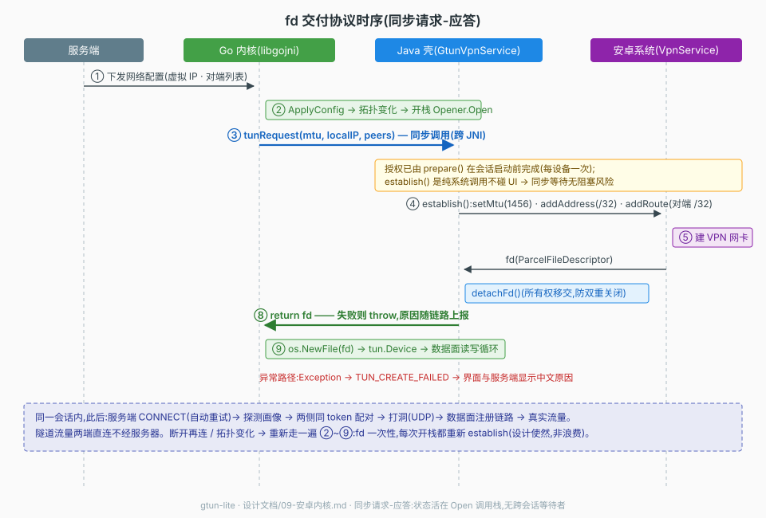

# 09 安卓内核(gomobile 库与 fd 交付协议)

安卓端不是独立的第二套客户端,而是**同一内核的库形态**:`cmd/gtunlib` 经
gomobile 把打洞、控制面与数据面整套内核编成 aar,交给移动端壳(Android
VpnService / 未来 iOS NetworkExtension)驱动。本文覆盖:导出层契约、fd
交付协议、桩路由、构建要求与机制。壳工程(界面/桥/打包)的集成视角在
壳工程侧文档,不在本仓。

## 第 1 节 库形态与导出契约(cmd/gtunlib)

桌面端 `cmd/client` 与库形态的分工差异只有一处——**生命周期**:桌面端
「进程即会话」靠信号优雅退出;移动端「壳进程长存,会话由宿主启停」,
Start/Stop 显式管理内部 context。装配序列与桌面 main.run 严格同构:
配置 → 日志 → fd 预算自检 → 身份 → manager → fd 回调注册 → 控制面
(差异对照见第 5 节)。

对宿主暴露的全部 API(gomobile 生成,javap 可验证):

```java
gtunlib.Gtunlib
  static void setListener(EventListener)                 // 注册宿主回调
  static void start(String configPath) throws Exception  // 异步起会话
  static void stop() throws Exception                    // 停会话,幂等
  static boolean isRunning()

gtunlib.EventListener(宿主实现)
  void notice(String line)                  // 中文状态,一行一条(同桌面窗口提示)
  long tunRequest(long mtu, String localIP, String peers)
      throws Exception                      // 同步要 fd,见第 2 节
```

配置仍走 client.yaml 全量显式,由宿主壳按 `DefaultConfig()` 生成后传入
路径;身份文件路径由 yaml 指向应用私有目录。

## 第 2 节 fd 交付协议(同步请求-应答)

安卓不允许普通进程开 TUN;`VpnService.establish()` 必须由持有授权的宿主
调用。因此安卓的 `tun.Opener`(internal/tun/androidfd)不自己开设备,而是
**同步回调宿主要 fd**——与 03 的三平台「Opener 自己开设备」形成第四种
平台实现。



### 2.1 契约

```go
type TunRequester interface {
    // 完成 establish 后对 ParcelFileDescriptor detachFd 并返回裸 fd;
    // 失败返回非 nil error(gomobile 映射为 Java 异常)。
    RequestTun(mtu int64, localIP, peers string) (int64, error)
}
```

时序(内核在 ApplyConfig 拿到虚拟 IP 之后,对应上图 ②~⑨):

1. 内核开栈 → 同步回调 `tunRequest(mtu, localIP, peers)`(跨 JNI);
2. 宿主 `Builder.setMtu / addAddress(localIP/32) / addRoute(各 peer /32)`
   → `establish()` → 系统建 VPN 虚拟网卡 → fd;
3. 宿主 `detachFd()` 后**同步返回** fd(异常则抛回,消息原路上报);
4. 内核 `os.NewFile(fd)` 包成 tun.Device,数据面读写循环启动。

### 2.2 设计约束(每条对应一次真实踩坑)

| # | 约束 | 违反的后果(历史) |
|---|---|---|
| 1 | **同步请求-应答**:RequestTun 直接返回 fd,无异步暂存 | 异步形态出过三连 bug:漏接线全链路 TUN_CREATE_FAILED(7bce9f2);Abandon 信号跨会话泄漏(193acfd);断开重连 fd 就绪时 select 随机二选一 ≈50% 失败(3d55f96 收敛) |
| 2 | **授权在会话启动前解决**:宿主先 prepare(弹框)再 Start;establish 是纯系统调用不碰 UI | 同步等待无阻塞风险是本协议成立的前提 |
| 3 | **fd 一次性**:每次开栈重新 establish,不缓存 | fd 随 VPN 接口生灭,缓存必失效 |
| 4 | **所有权显式移交**:Java detachFd ↔ Go Close | 双重关闭 = 抽走对方正在用的把手 |
| 5 | **回调注册先于首次开栈** | gtunlib.run 装配时 SetTunRequester;漏接即约束 1 的三连第一坑 |
| 6 | **失败原因原路上报**:Java 异常消息 → error → Reason → 服务端 | 页面只看到失败无原因曾是排障噩梦 |

### 2.3 为什么不用异步形态

异步(pending 暂存 + delivered 信号 + abandoned 放弃通道)曾被采用并连出
2.2 的三个 bug——同根:**包级全局状态的会话生命周期对不齐**。同步形态下
状态全部活在 Open 调用栈,调用返回即消失,没有跨会话的东西可以对不齐。
若未来某平台确需异步(iOS NetworkExtension 回调式吐包),正确形态是
「每会话一个 broker 对象」:channel 生命周期 = 对象生命周期 = 会话生命
周期,靠构造保证不变量,而非靠调用方记得按顺序调重置函数。

## 第 3 节 路由:桩实现的理由

安卓路由由 VpnService 声明式管理(addRoute 随接口生灭,无系统 /32 残留),
preflight 的 RouteTable 用桩实现:恒答「无网关、无本机地址、无既有路由」。
**保留地址与服务器地址两项检查照常生效**(数值合法性不依赖平台),其余
冲突类检查在安卓上不存在检查对象。RouteCleanup 只负责关设备。构建标签:
`opener_android.go`(android)、`opener_linux.go` 改 `linux && !android`。

## 第 4 节 构建:make build-android-lib 与版本要求

### 4.1 版本矩阵(只看"Go 编译出 aar"这条链,均有出处)

| 组件 | 要求 | 出处 |
|---|---|---|
| Go 工具链 | ≥ 1.26 | x/mobile(2026-08 快照)go.mod `go 1.26.0` |
| Android NDK | ≥ 24(Apple Silicon) | env.go:NDK 23 及以前无 arm64 darwin 工具链,24 起 universal |
| ANDROID_HOME | 必须设置 | gomobile 启动即扫 `$ANDROID_HOME/ndk/`,无 NDK 直接拒绝(`no usable NDK`) |
| JDK | bind 本身无下限(26/17 实测均可) | **17 的硬约束来自下游**:壳工程 AGP 7.4 的 D8 不认 javac 26 的新 class 属性(dex 阶段 NPE),与构建方 JDK 无关 |
| -androidapi | gomobile 仅要求 ≥ 16 | `minAndroidAPI = 16`;传 26 是对齐壳工程 minSdk |

NDK 多版本共存时 gomobile 自动选语义版本最高的可用者(env.go:415):
本机 27.2(Go 链用,产物默认 16KB 页对齐)与 23.1(壳工程 AGP 用)互不
干扰。

### 4.2 Makefile target

```bash
make build-android-lib    # 产物:bin/android/gtunlite.aar (+ gtunlite-sources.jar)
```

环境三件套由 target 内部固化(`?=` 可覆盖):`ANDROID_JAVA_HOME` 指 JDK 17
(下游 D8 约束)、`ANDROID_HOME` 定位 NDK、`PATH` 前置 `~/go/bin`(gomobile
的伴生工具 gobind 靠 PATH 定位——`go tool gomobile` 自身不依赖 PATH,但
找不到 gobind 会报 "run gomobile init")。只产出到 bin/android/,投放壳
工程由使用侧自理。

### 4.3 gomobile 机制(一条命令的四步)

```
① gobind 扫描 cmd/gtunlib 导出符号 → 生成 Java 胶水源码
② Go 交叉编译:内核 + Go 运行时 + Go 侧桥(四架构)
③ NDK clang 编 C 写的 JNI 桥并链接 bionic → libgojni.so × 4 架构
④ 打包 aar = classes.jar(①) + jni/<abi>/libgojni.so(③) + 清单
```

**纯 Go 代码也要 NDK**:JNI 桥是 C 写的(`Java_go_Seq_*` 符号,nm 可验),
必须用面向安卓的交叉 clang;NDK 在任何 Go 编译开始前即被校验。

## 第 5 节 与桌面端的差异边界

打洞、协议、数据面、manager 与桌面端**同一套代码,零改动**(04 的设计
原样成立)。安卓适配集中四处,平台差异被 03 的 `tun.Opener` /
`tun.RouteTable` 两个接口挡住——这是移植总代价只有「fd 协议 + 路由桩 +
库入口」的结构性原因:

| 差异点 | 桌面端 | 安卓端 |
|---|---|---|
| 入口 | 独立进程 main.go,信号退出 | 库形态 Start/Stop,context 控制 |
| TUN 打开 | 自己开 utun//dev/net/tun/wintun | establish → 同步要 fd(第 2 节) |
| 路由表 | 真实系统查询 | 桩实现(第 3 节) |
| 状态提示 | notice → stderr | notice → 管道 → EventListener → 宿主界面 |
